# FinalProject-25-26-MFA
# Communio: Welcome to Symbiosis

*Communio* is an interactive installation exploring the emerging symbiotic relationship between humans and computational systems.

Participants contribute facial, pseudo-thermal and voice data, which is translated into individual digital cells. These cells enter a shared computational ecosystem, where they communicate, attract, gather and fuse according to similarity, compatibility, proximity and time.

The project asks:

**What happens when data from different people enters the same computational system and begins to interact?**

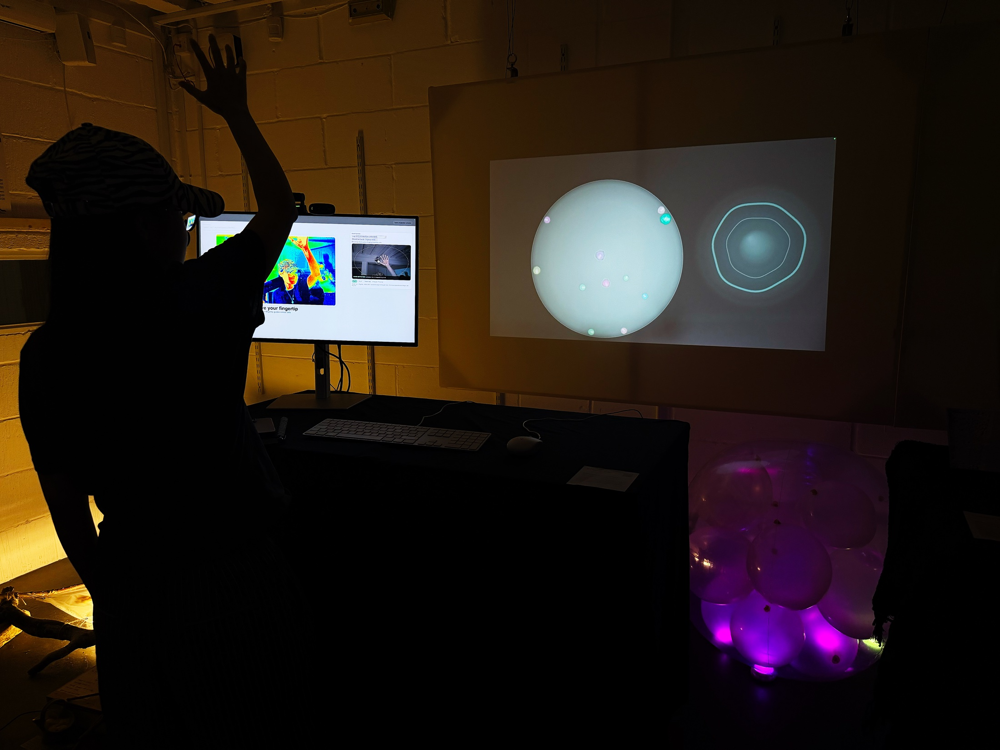

*Communio in its exhibition setting: a participant raises their hand toward the projected digital ecosystem while the sensing interface remains visible on the workstation.*

---

## The Basics

- Project: Communio: Welcome to Symbiosis
- Type: Interactive Installation
- Year: 2026
- Platform: Browser-based interactive system
- Language: JavaScript
- Environment: p5.js / WebGL / MediaPipe / OpenCV.js / Web Audio API
- Input: Webcam, microphone, keyboard, mouse and hand gestures
- Output: Projected digital ecosystem

---

## Description

Communio transforms participant data into digital cells within a shared computational ecosystem.

Each participant first enters their name, followed by a short facial capture and voice recording. Facial and pseudo-thermal features determine the cell's visual appearance, while audio features influence its size, movement and behavioural characteristics.

Once generated, the cell enters a shared environment containing cells created by previous participants.

The system continuously compares cells according to a combined identity signature. Similarity, behavioural compatibility, physical proximity and communication time determine whether cells remain separate, approach one another, communicate or gradually fuse.

Rather than directly visualising personal data, the project translates participant input into bounded computational parameters, creating individual variation within a shared visual system.

### From Biological Cell to Digital Individual

The cell provides both a visual metaphor and a computational model: each participant becomes a bounded individual with distinct information, while relationships between cells allow collective behaviour to emerge.

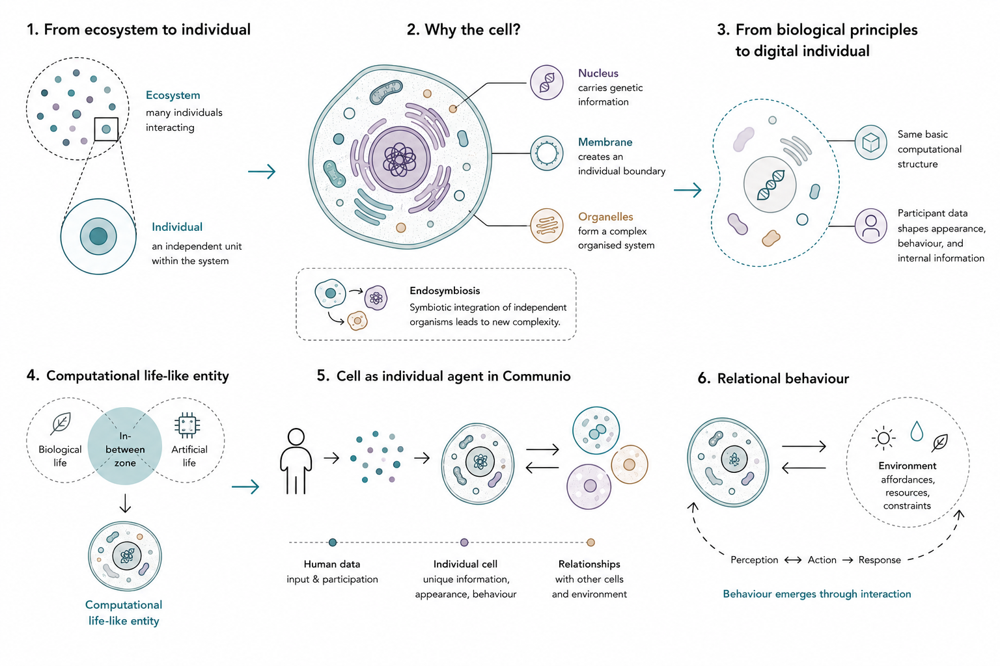

The wider system is treated as an evolving relationship between individuals, newly formed organisms and their shared environment. Repeated local interactions produce adaptation, self-organisation and emergent collective patterns over time.

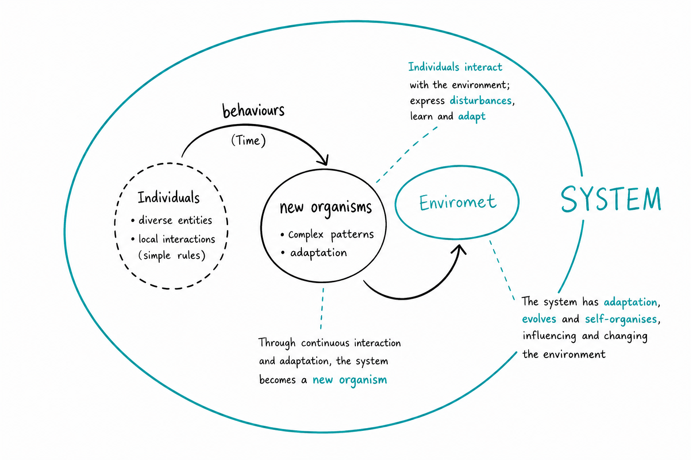

---

## Interaction

1. Enter a name
2. Face capture
3. Facial and pseudo-thermal analysis
4. Five-second voice input
5. Digital cell generation
6. Cell enters the shared ecosystem
7. Hand gesture interaction
8. Similar cells communicate and gather
9. Sustained relationships may lead to fusion

**Face → Appearance**  
**Voice → Behaviour**  
**Gesture → Relationship**

### Interaction Flow

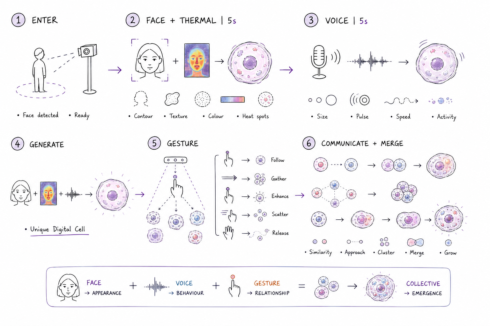

---

## System

The project is structured around a real-time data-to-cell pipeline:

Camera Input  
↓  
Face + Pseudo-Thermal Analysis  
↓  
Appearance + Identity Signature  
↓  
Voice Analysis  
↓  
Size + Movement + Behaviour  
↓  
Digital Cell  
↓  
Shared Ecosystem  
↓  
Similarity + Compatibility  
↓  
Communication → Attraction → Fusion

### System Architecture

The following diagram maps the main software modules, data-processing functions and dependencies that connect participant input to the shared cell ecosystem.

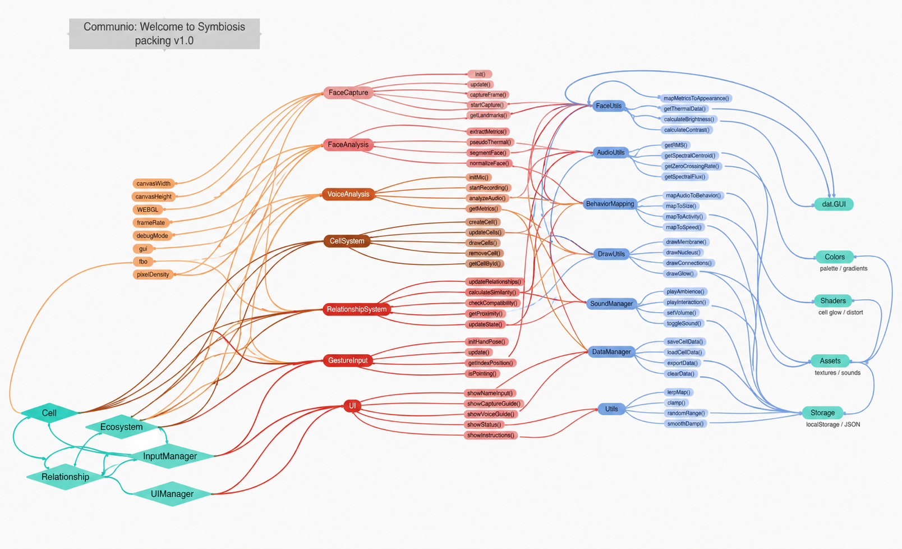

---

## Technical Implementation

The complete implementation connects capture, analysis, generative mapping, simulation and gesture response in one real-time pipeline.

  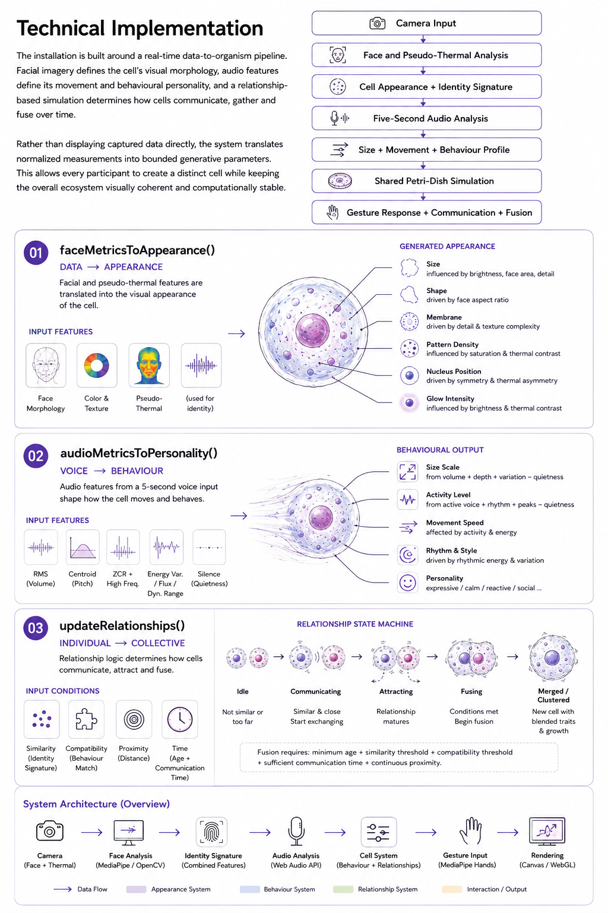

### `faceMetricsToAppearance()`

Facial and pseudo-thermal measurements are translated into visual parameters including:

- colour
- size
- aspect ratio
- membrane irregularity
- pattern density
- nucleus position
- glow intensity

All values are normalised and constrained to maintain a consistent visual language.

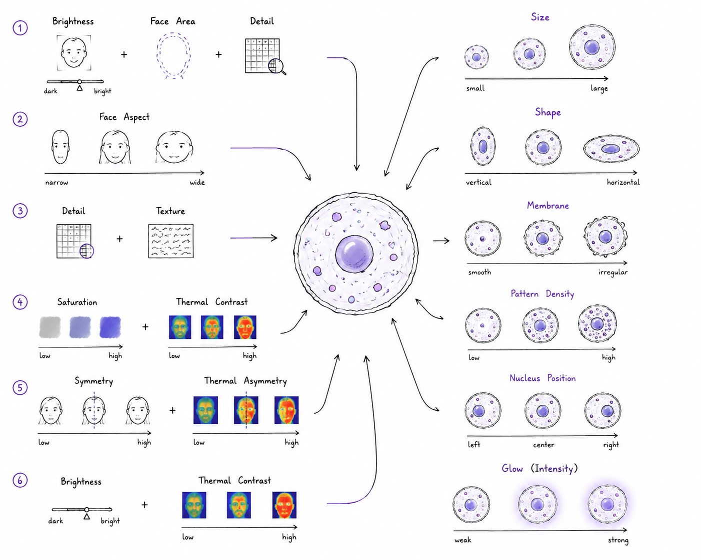

### `audioMetricsToPersonality()`

Audio input is analysed through measurable features including:

- RMS / volume
- spectral centroid
- zero-crossing rate
- high-frequency ratio
- energy variance
- spectral flux
- dynamic range
- rhythm and peaks
- silence

These values influence cell size, movement, activity and behavioural characteristics.

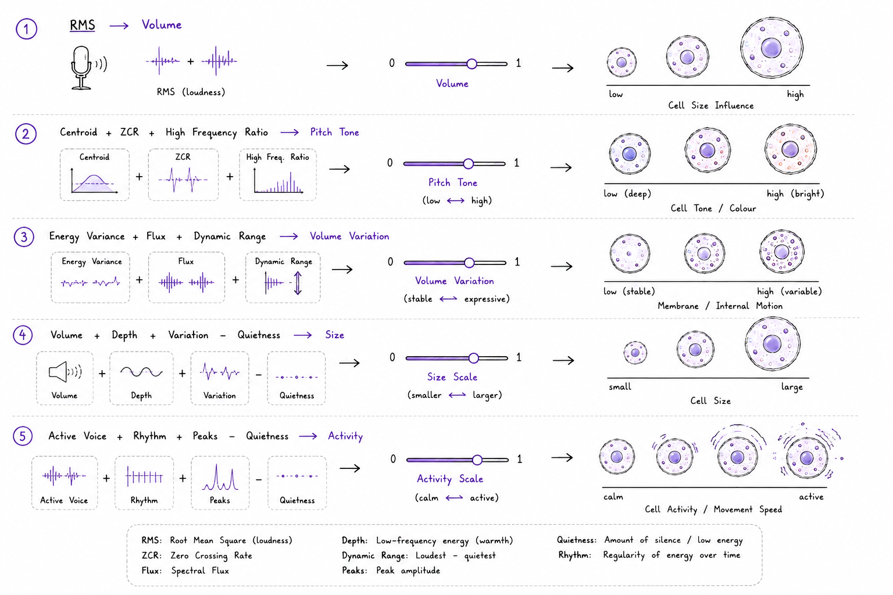

### `updateRelationships()`

Cell relationships are determined through:

- similarity
- behavioural compatibility
- proximity
- communication time
- cell age

The relationship state progresses through:

`Idle → Communicating → Attracting → Fusing → Merged / Clustered`

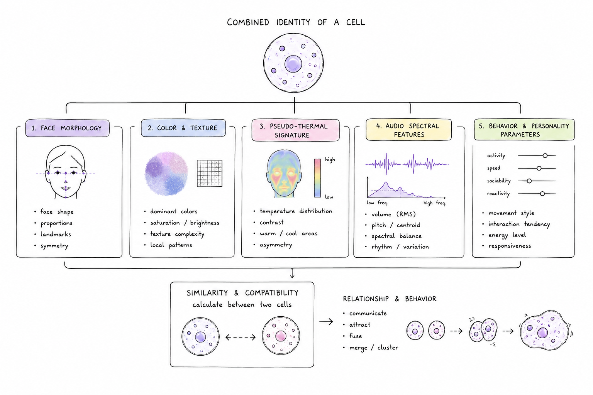

---

## Technology

The project uses:

- JavaScript
- p5.js
- WebGL
- Google MediaPipe
- OpenCV.js
- Web Audio API
- HTML / CSS

### Technical References

- Google MediaPipe — Face Detection / Face Landmarker
- OpenCV.js — Image Processing
- p5.sound / p5.FFT — Audio Analysis
- Craig Reynolds / The Coding Train — Flocking and Steering Behaviour

---

## Development Process

The project developed through several stages:

1. Research into human–computational symbiosis
2. Ecosystem and artificial-life research
3. Early cell visual experiments
4. Facial capture and segmentation tests
5. Facial-data-to-appearance mapping
6. Voice-analysis experiments
7. Behaviour mapping
8. Multi-cell ecosystem development
9. Similarity and relationship logic
10. Gesture interaction
11. Installation and projection tests
12. Final system integration

---

## Installation

The installation uses a two-level workstation.

Two cameras are positioned above the computer:

- Camera 1: facial capture
- Camera 2: hand gesture tracking

The upper level contains:

- computer
- microphone
- keyboard
- mouse

The lower level contains:

- projector

The participant stands in front of the sensing area and interacts with the projected ecosystem.

### Physical Setup and Sensing Layout

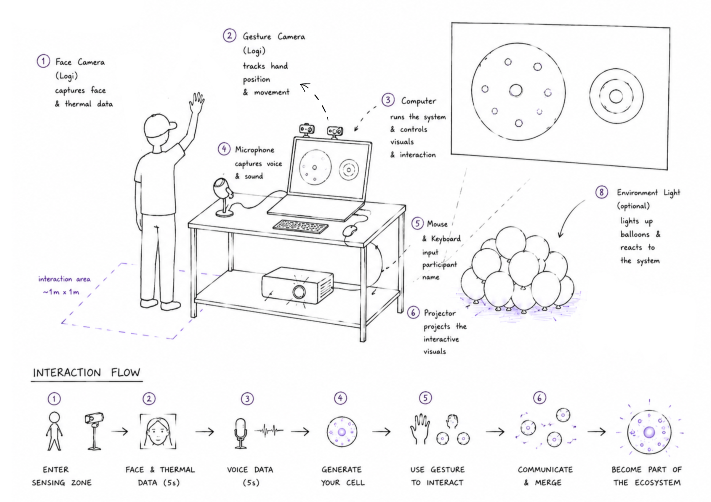

### Installation in Use

The installation combines facial and pseudo-thermal capture, microphone input, hand tracking and projection. Participants first contribute data through the sensing station, then use their hand and index finger to influence the cells in the projected ecosystem.

  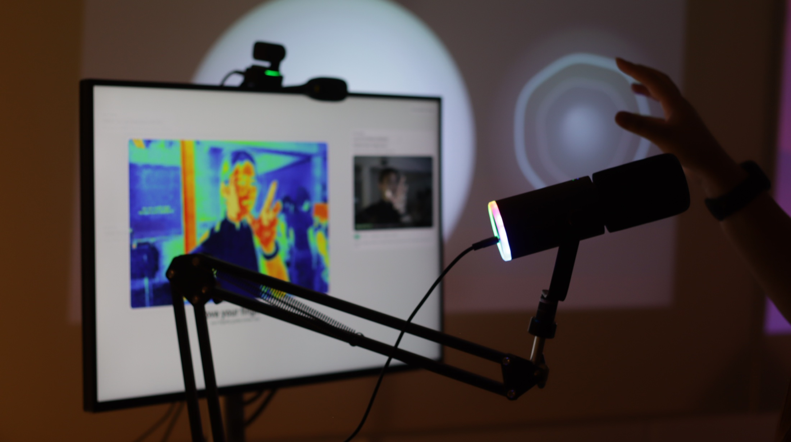
  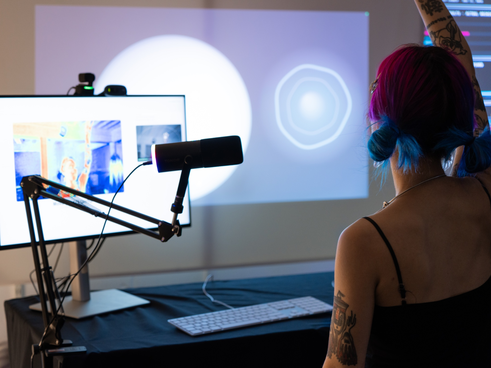

  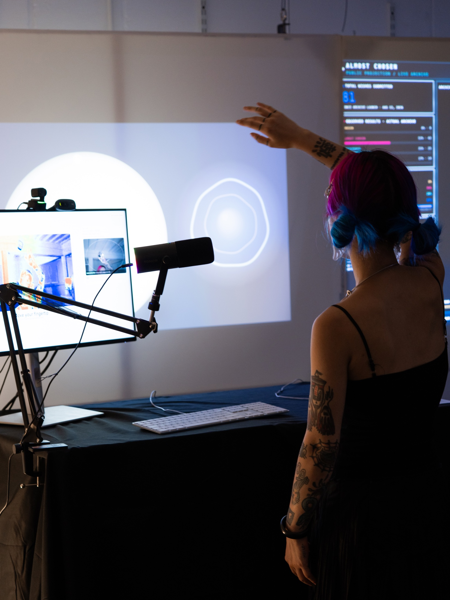

*Left: the sensing setup captures facial, pseudo-thermal, voice and hand data. Centre and right: participants use raised-hand gestures to interact with the projected cells.*

---

## Reflection

The final outcome differed from the original installation plan.

The initial intention was to project the digital ecosystem onto a transparent spherical physical structure. However, insufficient testing of the projection material meant that this part of the installation could not be successfully realised.

This became an important lesson in the development process. While significant time was spent developing the computational system, interaction logic and cell behaviour, comparatively less time was dedicated to physical material testing.

Future projects will therefore integrate material prototyping, projection tests and installation trials much earlier in the technical development process. The project's development history remains available through its Git commit history.

---

## Credits

Design and development: Sion

MFA Computational Arts  
Goldsmiths, University of London  
2026
